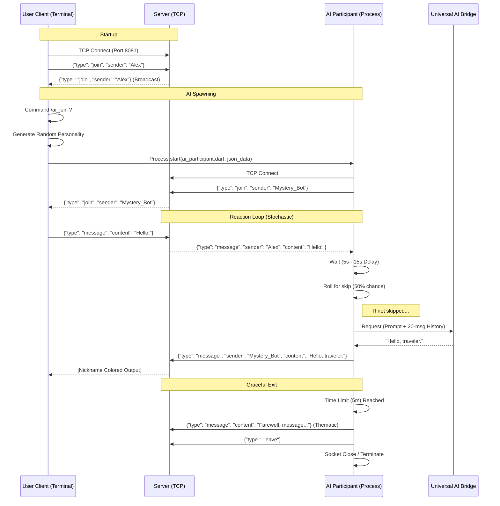

# Sequence Diagram: Chat Interaction

```mermaid
sequenceDiagram
    participant U as User Client (Terminal)
    participant S as Server (TCP)
    participant A as AI Participant (Process)
    participant E as Universal AI Bridge

    Note over U,S: Startup
    U->>S: TCP Connect (Port 8081)
    U->>S: {"type": "join", "sender": "Alex"}
    S-->>U: {"type": "join", "sender": "Alex"} (Broadcast)

    Note over U,A: AI Spawning
    U->>U: Command /ai_join ?
    U->>U: Generate Random Personality
    U->>A: Process.start(ai_participant.dart, json_data)
    A->>S: TCP Connect
    A->>S: {"type": "join", "sender": "Mystery_Bot"}
    S-->>U: {"type": "join", "sender": "Mystery_Bot"}
    
    Note over S,A: Reaction Loop (Stochastic)
    U->>S: {"type": "message", "content": "Hello!"}
    S-->>A: {"type": "message", "sender": "Alex", "content": "Hello!"}
    A->>A: Wait (5s - 15s Delay)
    A->>A: Roll for skip (50% chance)
    Note right of A: If not skipped...
    A->>E: Request (Prompt + 20-msg History)
    E-->>A: "Hello, traveler."
    A->>S: {"type": "message", "sender": "Mystery_Bot", "content": "Hello, traveler."}
    S-->>U: [Nickname Colored Output]

    Note over A,S: Graceful Exit
    A->>A: Time Limit (5m) Reached
    A->>S: {"type": "message", "content": "Farewell, message..."} (Thematic)
    A->>S: {"type": "leave"}
    A->>A: Socket Close / Terminate
```
