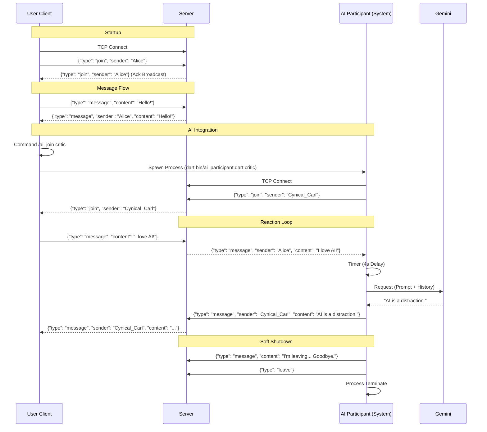

# Sequence Diagram: Chat Interaction

```mermaid
sequenceDiagram
    participant U as User Client
    participant S as Server
    participant A as AI Participant (System)

    Note over U,S: Startup
    U->>S: TCP Connect
    U->>S: {"type": "join", "sender": "Alice"}
    S-->>U: {"type": "join", "sender": "Alice"} (Ack Broadcast)

    Note over U,S: Message Flow
    U->>S: {"type": "message", "content": "Hello!"}
    S-->>U: {"type": "message", "sender": "Alice", "content": "Hello!"}

    Note over U,A: AI Integration
    U->>U: Command /ai_join critic
    U->>A: Spawn Process (dart bin/ai_participant.dart critic)
    A->>S: TCP Connect
    A->>S: {"type": "join", "sender": "Cynical_Carl"}
    S-->>U: {"type": "join", "sender": "Cynical_Carl"}
    
    Note over S,A: Reaction Loop
    U->>S: {"type": "message", "content": "I love AI!"}
    S-->>A: {"type": "message", "sender": "Alice", "content": "I love AI!"}
    A->>A: Timer (4s Delay)
    A->>Gemini: Request (Prompt + History)
    Gemini-->>A: "AI is a distraction."
    A->>S: {"type": "message", "sender": "Cynical_Carl", "content": "AI is a distraction."}
    S-->>U: {"type": "message", "sender": "Cynical_Carl", "content": "..."}

    Note over A,S: Soft Shutdown
    A->>S: {"type": "message", "content": "I'm leaving... Goodbye."}
    A->>S: {"type": "leave"}
    A->>A: Process Terminate
```
